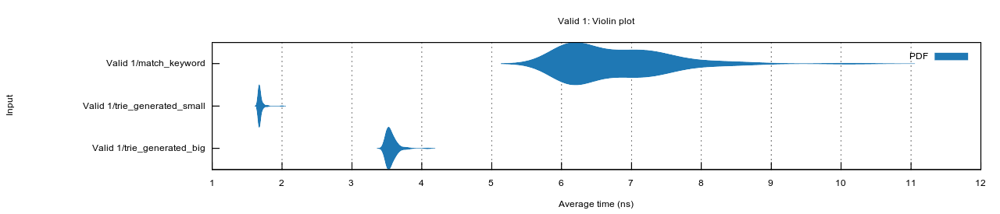
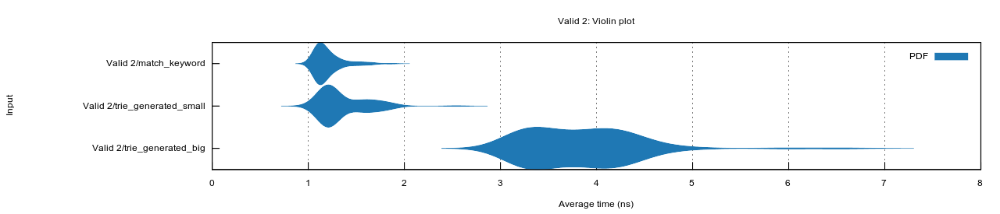
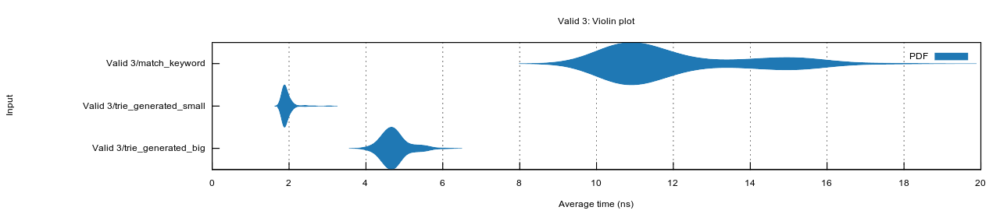
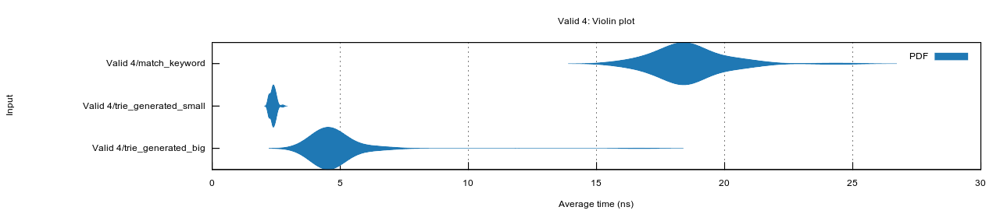
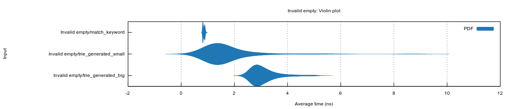
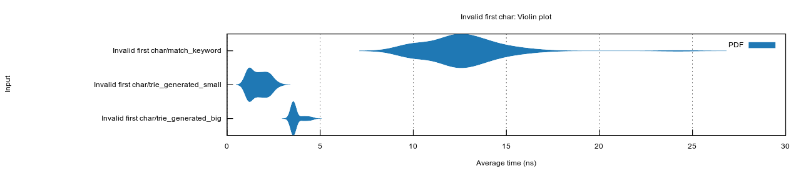
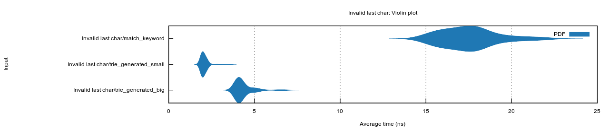
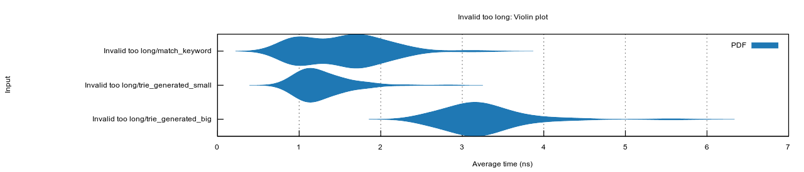
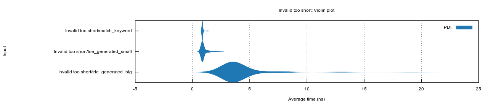

# static-atom
Represents a fixed set of strings as as a Rust `enum`. Efficiently translates incoming strings to the corresponding `enum` case.

# Benchmarks
[The benchmarks](src/lib.rs) decode any of of the following strings to `Option<usize>`:
- `"BTC-EUR"` produces `Some(1)`
- `"BTC-USDC"` produces `Some(2)`
- `"ETH-EUR"` produces `Some(3)`
- `"ETH-BTC"` produces `Some(4)`
- Anything else produces `None`

The approaches are:
- `match_keyword` - standard Rust `match` keyword. Checks the length of the slice, then checks the
  slice's pointer against a string literal, then calls `memcmp`.
- `trie_generated_small` - consume one or more bytes at a time to narrow down valid suffixes for
  the rest of the string. Consumes `u16`, `u32` or `u64` if the choices for the rest of the string
  are sufficiently different.
- `trie_generated_big` - like trie_generated_small, but the generated code tests against 24 strings not 4.

# Valid 1


# Valid 2


# Valid 3


# Valid 4


# Invalid empty


# Invalid first char


# Invalid last char


# Invalid too long


# Invalid too short


# Example generated code
```rust
#[derive(Copy, Clone, PartialEq, Eq, PartialOrd, Ord)]
pub enum Small {
    _0, // "BTC-EUR"
    _1, // "BTC-USDC"
    _2, // "ETH-EUR"
    _3, // "ETH-BTC"
}

#[macro_export]
macro_rules! small {
("BTC-EUR") => { $crate::Small::_0 };
("BTC-USDC") => { $crate::Small::_1 };
("ETH-EUR") => { $crate::Small::_2 };
("ETH-BTC") => { $crate::Small::_3 };
}

impl FromStr for Small {
    type Err = ();

    #[allow(unused_variables)]
    fn from_str(s: &str) -> Result<Self, ()> {
        let s = s.as_bytes();
        match s.len() {
            7 => {
                if let Some(s) = s.expect(b"BTC-EUR") {
                    Ok(small!("BTC-EUR"))
                } else if let Some(s) = s.expect(b"ETH-") {
                    if let Some(s) = s.expect(b"BTC") {
                        Ok(small!("ETH-BTC"))
                    } else if let Some(s) = s.expect(b"EUR") {
                        Ok(small!("ETH-EUR"))
                    } else { Err(()) }
                } else { Err(()) }
            }
            8 => {
                if let Some(s) = s.expect(b"BTC-USDC") {
                    Ok(small!("BTC-USDC"))
                } else { Err(()) }
            }
            _ => Err(())
        }
    }
}

impl Small {
    pub fn as_str(&self) -> &'static str {
        match self {
            small!("BTC-EUR") => "BTC-EUR",
            small!("BTC-USDC") => "BTC-USDC",
            small!("ETH-EUR") => "ETH-EUR",
            small!("ETH-BTC") => "ETH-BTC",
        }
    }
}

impl From<Small> for usize {
    fn from(token: Small) -> Self {
        match token {
            small!("BTC-EUR") => 0,
            small!("BTC-USDC") => 1,
            small!("ETH-EUR") => 2,
            small!("ETH-BTC") => 3,
        }
    }
}

impl fmt::Debug for Small {
    fn fmt(&self, f: &mut fmt::Formatter) -> fmt::Result {
        write!(f, "small!({})", self.as_str())
    }
}

impl fmt::Display for Small {
    fn fmt(&self, f: &mut fmt::Formatter) -> fmt::Result {
        f.write_str(self.as_str())
    }
}
```